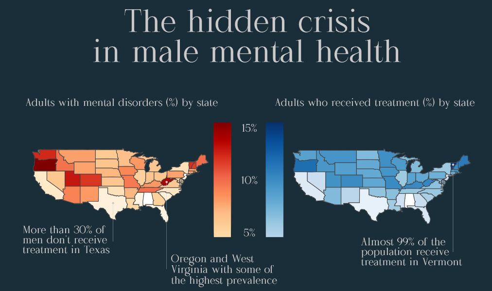

  

# The Hidden Crisis in Male Mental Health

Overview
This project explores the **treatment gap in male mental health** across U.S. states using publicly available data.  
While mental illness affects both men and women, men are **consistently less likely to receive treatment**.  

Through data cleaning, analysis, and visualization, this project highlights:
- How many adults live with mental disorders by state  
- How many receive treatment  
- Where men are most underserved compared to women  

The aim is to raise awareness of the hidden crisis in male mental health and demonstrate data storytelling through visual analytics.

---

Repository Structure

male-mental-health/

Data/ # Input datasets
- ami_by_gender.csv
- mental_disorder.csv
- treatment_received.csv
- sc-est2023-agesex-civ.csv

Visuals/ # Exported visuals (static + interactive)
- fig_dis.jpg # Disorder prevalence map
- fig_treat.jpg # Treatment received map
- fig_rate.jpg # Top 10 states (male treatment rate)
- fig_bottom_gap.jpg # Bottom 10 states (male treatment gap)
- interactive_disorder-18plus.html
- interactive_treatment-18plus.html
- interactive_top10_male_treatment_rate.html
- interactive_bottom10_male_treatment.html

|

- mmh_vis.pdf # Combined infographic
- mmh.py # Main Python script
- mmh_Project_Documentation.docx # Full documentation
- mmh_requirements.txt # Python dependencies

---

How to Run:

git clone https://github.com/OliverPaw/male-mental-health.git

cd male-mental-health

pip install -r mmh_requirements.txt
python mmh.py

Outputs:
- Static visuals (.jpg) saved in Visuals/
- Interactive visuals (.html) saved in Visuals/

Key Findings
- In states like Hawaii, New Mexico, and Texas, men have some of the lowest treatment rates.
- In contrast, Vermont and Minnesota show some of the highest rates of men receiving care.
- 41.6% of men with a mental illness receive treatment compared to 56.9% of women.
- In some states, treatment received exceeds reported prevalence (possible over-reporting or cross-treatment of non-diagnosed individuals).

Tools & Libraries

Python 3.11
Pandas (data cleaning & wrangling)
GeoPandas (geospatial joins)
Plotly Express (interactive & static visualizations)
Affinity Designer (final infographic design)

Author
Created by Oliver Pawlowski (@OliverPaw)
Part of a personal data visualization portfolio focused on socially relevant topics.

License  
This project is licensed under the [MIT License](https://opensource.org/licenses/MIT) – free to use and adapt with attribution.
